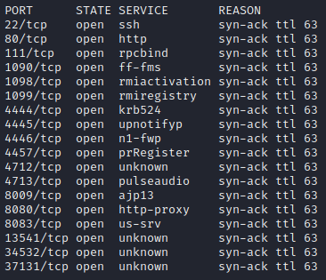
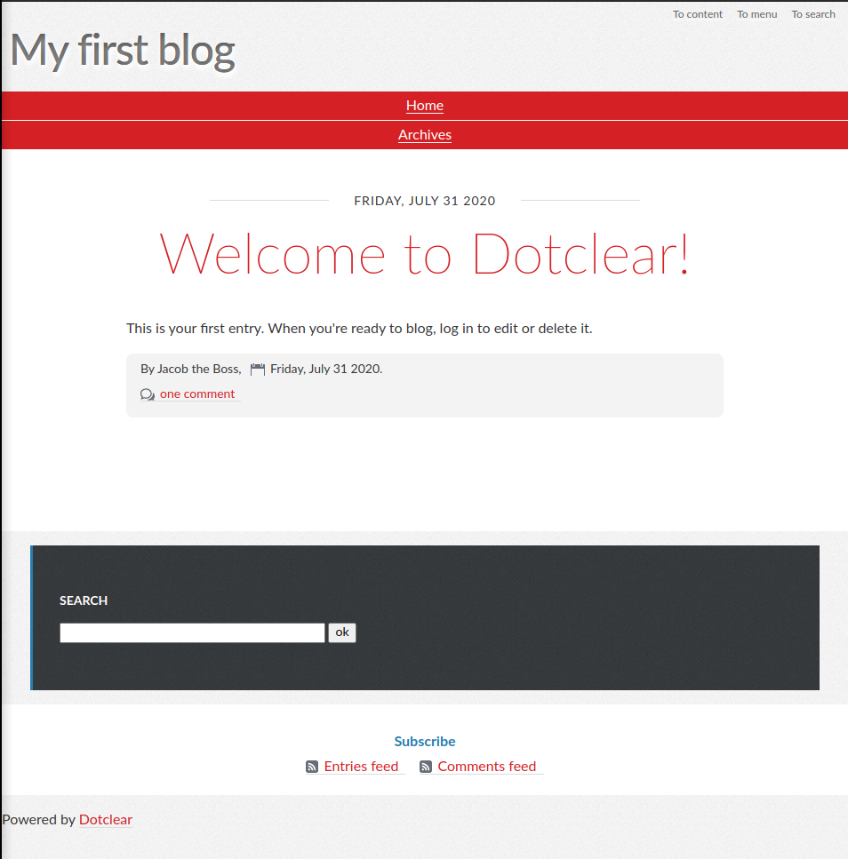
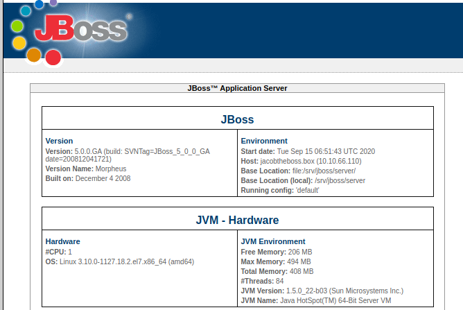
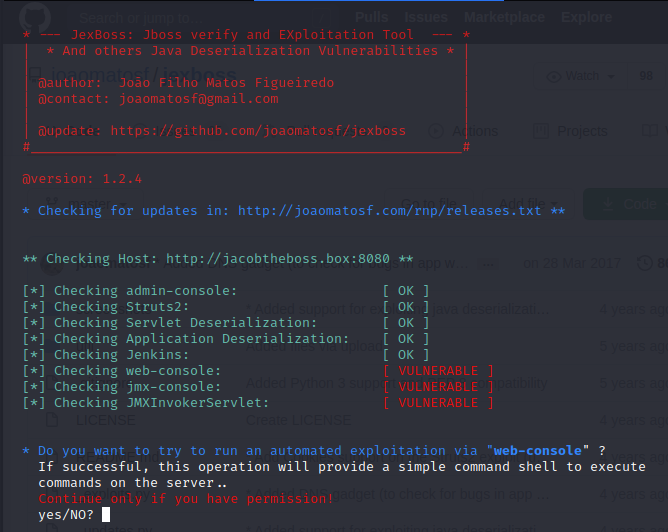
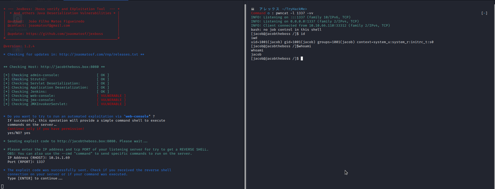
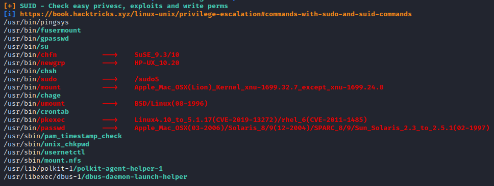

# Jacob The Boss - Tryhackme

***

**Jacob The Boss** is a medium difficulty room from Try Hack Me that uses a JBoss foothold for the inital shell along with a sneaky suid binary for priviledge escalation.

## Walkthrough - 

The first step is to add jacobtheboss.box to /etc/hosts and then as always is doing a port scan of the machine. The port scanner I'm using is rustscan which implements rust into nmap scans to try and speed them up, the github for it can be found [here](https://github.com/RustScan/RustScan)

```
rustscan -u 5000 [IP] -- -sC -sV -Pn
```

The output from rustscan is a bit colourful but this is what you want to pay attention to



Most of these won't yeild you much but feel free to enumerate them in your own time. In the mean time we want to check out all the web based ports i.e. 80, 8009 and 8080

Starting with port 80 we are greeted with a blog page powered by dotclear with only one post 

***
The post is just detailing how the new CMS will make the 'company' more dynamic.

Port 8009 is useless to us since we can't connect so we can move straight onto port 8080

Port 8080 is a JBoss Application Server.

***
In terms of what JBoss is and what is does is a topic for another day you can read some basic info on it [here](https://www.theserverside.com/definition/JBoss).

If we start looking into possible exploits for this service you'll soon find an Exploit-DB page for RCE depending on the version. You can check the version of JBoss by going to JBoss Web Console on port 8080, showing us that this service is vulnerable to the RCE exploit
.
***
While this exploit will work for getting code execution there is a script that was made to exploit JBoss configurations that can give a shell immediately the script call [JexBoss](https://github.com/joaomatosf/jexboss).

Clone this script and cd into the directory. To execute the script all you have to do is provide it with the url to the JBoss config.

```python
python jexboss.py -u http://jacobtheboss.box:8080
```

Afterwards you should be greeted with this

***
Type yes and you'll then be asked to input a listening host and port, input your IP address and a port you want to list on and set up a listener to the same spec.

If all went well you will get a shell as the user Jacob.


***

The listener I'm using is [pwncat](https://pwncat.org/) on the recommendation of a friend 

## Privledge Escalation 

The priviledge escalation for this one took me a lot longer than I care to admit, primarily because I missed the path my first time around. But with enumaration and some quick googleing the path is pretty clear.

So first things first, I upload linpeas because I'm lazy and really like it.
You can do this with just a simple python server and wget. If you find that you need to clear your shell you'll get an error to stop this run 

```
export TERM=xterm

```

Python Server

```python
python3 -m http.server 80
```
I have an alias for this command so that's why I only put http.server 80 
 
***
Chmod the script and run it.

There's a lot to unpack in the output that you should go through yourself. After a bit you'll reach the SUID section and this is the part that took up my time the first time because I missed the unusal program

***
Hopefully you'll notice it quicker than I did.

The binary in question is /usr/bin/pingsys, now this is something I'd never heard of before so I naturally went to google to get a little bit more information about how it worked. After a while I stumbled across security.stackexchange post discussing privilege Escalation and pingSys was highlighted [The Article](https://security.stackexchange.com/questions/196577/privilege-escalation-c-functions-setuid0-with-system-not-working-in-linux). The article is from someone creating a binary to demonstrate privilege escalation through insecure code and is asking the community why they aren't able to get privilege escalation. A user comments a possible method to get PE using the binary so might as well give it a try right.

The command is as follows
```
/usr/bin/pingsys '127.0.0.1; /bin/sh'
```

And it works as seen below

***

You can spawn a better shell with python, but you are effectively the root user so you can go a retrieve the flags for the room.