# Vulnix - Vulnhub
[Download Link](https://www.vulnhub.com/entry/hacklab-vulnix,48/)

[Creators Links](https://www.vulnhub.com/author/reboot-user,20/)

Vulnix a relatively simple machine taking advantage of nfs shares, 

Since this machine is being hosted locally we don't know the IP address out of the box, so we'll have to run netdiscover to find it.

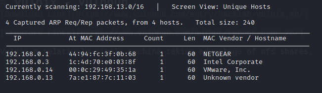

***

Okay now we can get into the good stuff... Port scanning, okay not that exciting but still necessary. I'm using rustscan for my port scanning and you can check it out [here](https://github.com/RustScan/RustScan). I've also added the IP address to /etc/hosts under the name vulnix.

```
rustscan -u 5000 vulnix -- -sC -sV -Pn
```

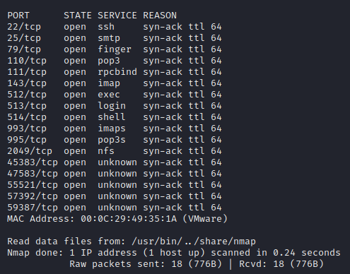

***

There's a lot to unpack with this one, and everyone has they're own method for enumeration. I'm immediately drawn to port 2049 or the NFS service so lets check if there are any files we can mount. You can do that by running ```sudo showmount -e vulnux```.

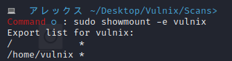

**

Okay so a couple of things the big one of interest is /home/vulnix so lets mount this.

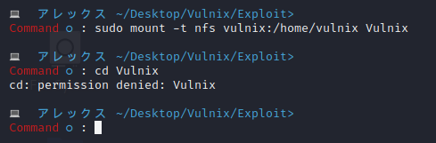


***

Hmmm so even though we can mount the folder we can't access it. The issue is something called rootsquashing, you can read more about it [here](https://en.wikipedia.org/wiki/Unix_security#Root_squash).

So how do we bypass this, there is a very good tool called [nfspy](https://github.com/bonsaiviking/NfSpy). That can automatically falsifiy NFS credentials when a share is mounted. Firstly unmount the share.
```
umount Vulnix
```

and we can run .
```
nfspy -o server=vulnix:/home/vulnix Vulnix
```

You might have to run the command as sudo.

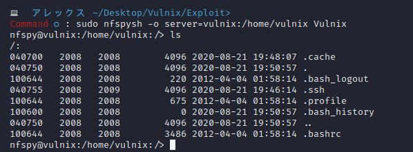 


***

Having a look around we see a .ssh folder, maybe we can get some keys. Looking back on the nmap scan we can see that ssh is enabled so if there are keys we should be able to login as vulnix using them. 

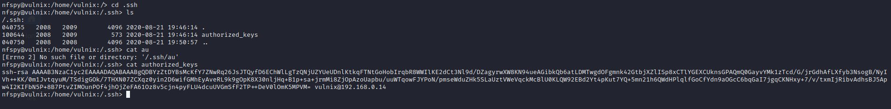

***

Hmmm... That's ashame, but it isn't the end of the world, if we have write permissions over this share we can just create our own keys and upload them, so lets give that a go. First lets test if we can even write onto the share.

I'll create just a simple text file and try to mv it onto the system.

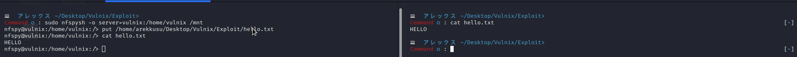

***

Great so we can upload files onto the system, lets generate some keys and get them in place.

To do this you want to run.
```
ssh-keygen -t rsa
```
Give it a path, don't worry about putting a password on them.

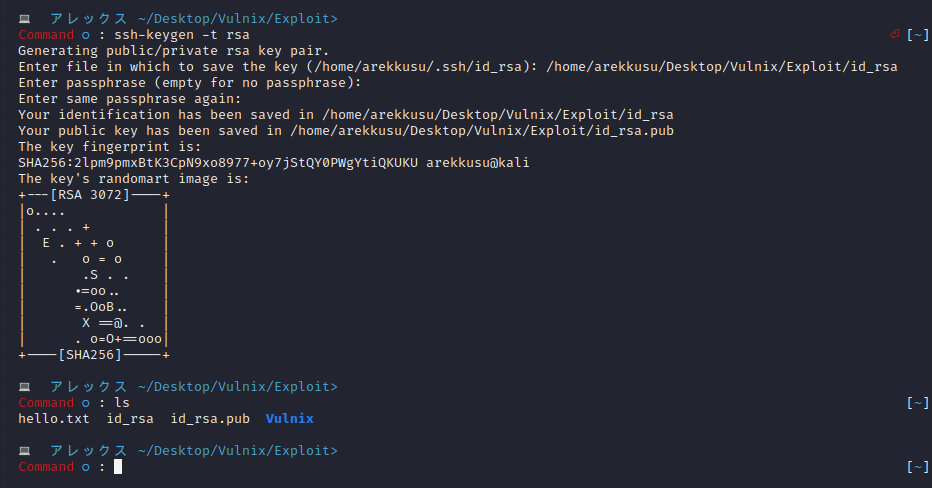

***

Rename the public key (the file with .pub after it) to authorized keys. delete the authorized keys that is in the .ssh folder in the mount and put you're own on there.

Chmod 600 the private key and ssh into the system using.
```
ssh -i id_rsa vulnix@vulnix
```

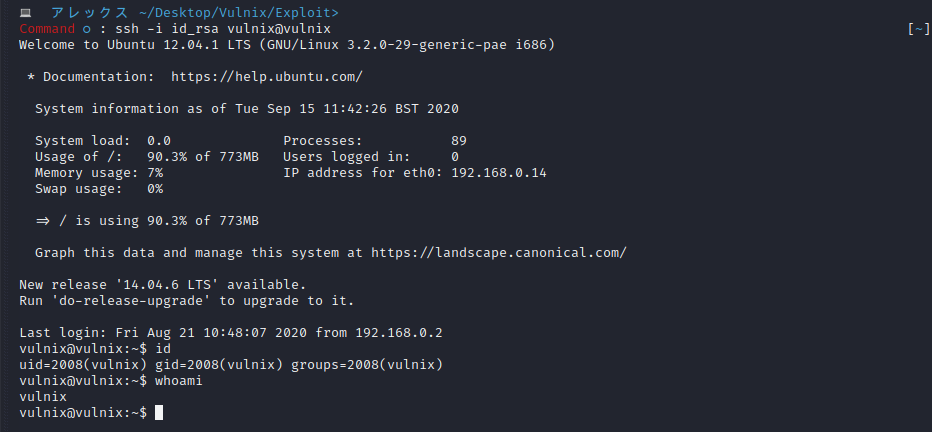

***

## Privilege Escalation

Okay standard enumeration applies here to begin with. The first thing I'm going to do is upload linpeas to get some information about the system.

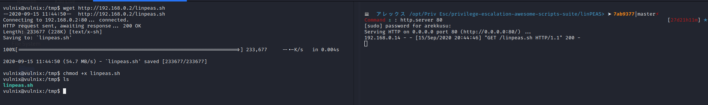

***

The output is a bit much as always. There are a couple of things that stick out here, the linux kernel version, and that vulnix can run sudoedit on /etc/exports as root without a password. Now the second one means we can stop the rootsquashing that caused those issues in the beginning. It also means we can make the /root directory mountable and the it's just the same process as getting user but with less steps (Which we ignored). 

To do that we just run the command as detailed when we run sudo -l and replace root_squash with no_root_squash, and add the line.

```
/root		*(rw,no_root_squash)
```

Before

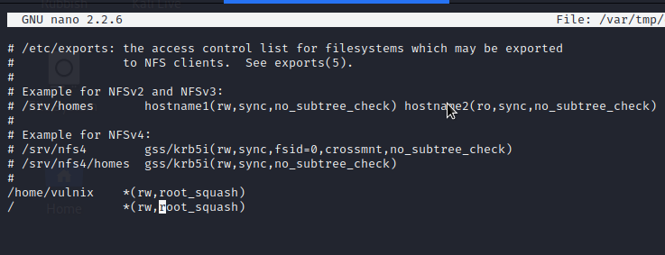

***

After

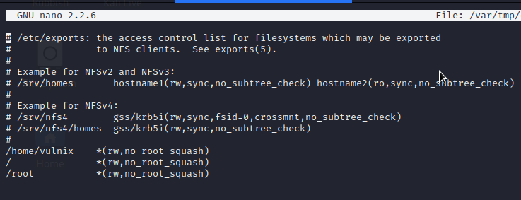

***

After this reboot the system from your virtualisation software (I know it's kind of cheating but it's the best we've got) and repeat the same procedure that we did for getting vulnix and ssh into your brand new root shell.

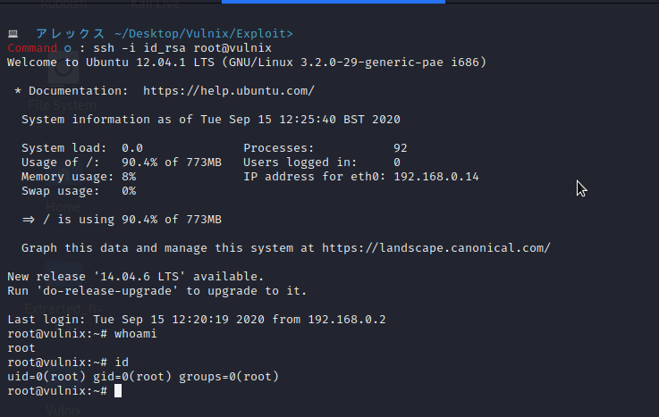

***

P.S There is another user on this system called user who's password is bruteforcable with hydra after you've gotten this user you can then upload ssh keys the same way we did before to get into vulix.

